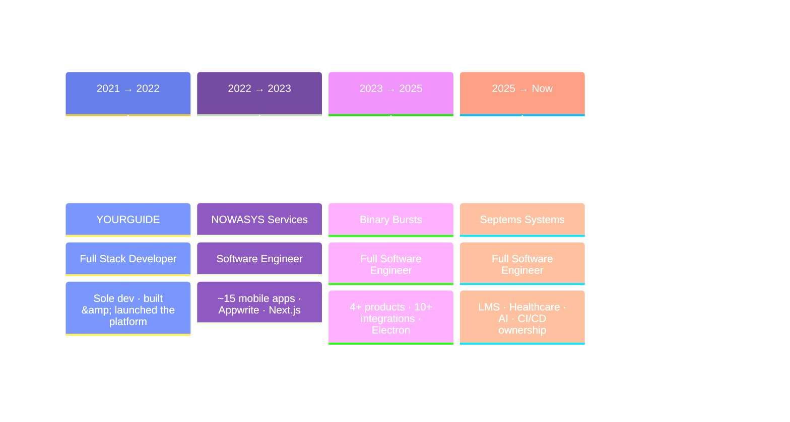

<!-- ═══════════════════════════ HERO ═══════════════════════════ -->
<div align="center">
  
</div>

<div align="center">
  
</div>

<div align="center">
  
  
  
  
</div>

<!-- ═══════════════════════════ NAV ═══════════════════════════ -->
<div align="center">
  <br/>
  <a href="#about"></a>
  <a href="#stack"></a>
  <a href="#work"></a>
  <a href="#journey"></a>
  <a href="#stats"></a>
  <a href="#connect"></a>
</div>


<!-- ═══════════════════════════ ABOUT ═══════════════════════════ -->
<a name="about"></a>
<div align="center">
  
</div>


```typescript
const haris: Engineer = {
  role:      "Sr. Full Stack Engineer",
  location:  "Pakistan  ·  Remote-friendly",
  education: "BS Computer Science, UMT",
  experience: "4+ years",

  domains: ["Healthcare", "FinTech", "E-Commerce", "AI", "EdTech"],

  buildsWith: {
    web:     ["React", "Next.js", "TypeScript", "Redux", "Tailwind"],
    mobile:  ["Ionic", "Capacitor"],
    desktop: ["Electron"],
    backend: ["NestJS", "Express", "Node.js", "REST", "Redis"],
    cloud:   ["AWS", "GCP", "Docker", "Nginx", "Jenkins"],
  },

  currentFocus: "AI-powered products & scalable architectures",
  motto: "High-quality, maintainable code — delivered on deadline.",
};
```

<br clear="right"/>

<table align="center">
  <tr>
    <td width="33%" align="center">
      <h3>🏗️ I Build End-to-End</h3>
      <p>Frontend, backend, mobile, desktop and the pipeline that ships it. No handoff gaps.</p>
    </td>
    <td width="33%" align="center">
      <h3>🔌 I Make Systems Talk</h3>
      <p><b>10+</b> third-party integrations — payments, accounting, shipping, AI, maps.</p>
    </td>
    <td width="33%" align="center">
      <h3>🔍 I Raise the Bar</h3>
      <p>Lead code reviews, refactor tangled logic, and tune performance until it's fast.</p>
    </td>
  </tr>
</table>


<!-- ═══════════════════════════ STACK ═══════════════════════════ -->
<a name="stack"></a>
<div align="center">
  
</div>

<div align="center">
  
  <p><i>↑ my daily drivers — the full arsenal below ↓</i></p>
</div>

<details open>
<summary><b>&nbsp;🎨&nbsp; Frontend &amp; UI</b></summary>
<br/>
<div align="center">
  
  <br/><br/>
  
  
  
  
</div>
</details>

<details open>
<summary><b>&nbsp;📱&nbsp; Mobile &amp; Desktop</b></summary>
<br/>
<div align="center">
  
  <br/><br/>
  
  
  
</div>
</details>

<details open>
<summary><b>&nbsp;⚙️&nbsp; Backend &amp; APIs</b></summary>
<br/>
<div align="center">
  
  <br/><br/>
  
  
  
</div>
</details>

<details open>
<summary><b>&nbsp;🗄️&nbsp; Databases &amp; ORMs</b></summary>
<br/>
<div align="center">
  
  <br/><br/>
  
  
  
  
</div>
</details>

<details open>
<summary><b>&nbsp;☁️&nbsp; Cloud, DevOps &amp; CI/CD</b></summary>
<br/>
<div align="center">
  
  <br/><br/>
  
  
  
</div>
</details>

<details open>
<summary><b>&nbsp;🔌&nbsp; Integrations &amp; Tooling</b></summary>
<br/>
<div align="center">
  
  
  
  
  
  
  
  
  <br/><br/>
  
</div>
</details>

<br/>

<div align="center">

### 📈 Where I'm Strongest

| | Skill | Proficiency |
|:-:|:--|:--|
| ⚛️ | **React / Next.js** | `██████████` |
| 🟦 | **TypeScript / JavaScript** | `██████████` |
| 🟩 | **Node.js / NestJS / Express** | `█████████░` |
| 📱 | **Ionic / Capacitor** | `█████████░` |
| 🗄️ | **SQL / NoSQL & ORMs** | `████████░░` |
| ☁️ | **AWS / Docker / CI-CD** | `███████░░░` |
| 🖥️ | **Electron** | `███████░░░` |

</div>


<!-- ═══════════════════════════ WORK ═══════════════════════════ -->
<a name="work"></a>
<div align="center">
  
</div>

<table>
  <tr>
    <td width="50%" valign="top">
      <h3>🎓 University LMS</h3>
      <p><b>KEAN University</b> · Septems Systems</p>
      <p>Spearheaded a fully customized Learning Management System — courses, enrollment, assessments and reporting built from the ground up.</p>
      <p>
        
        
        
      </p>
    </td>
    <td width="50%" valign="top">
      <h3>🏥 Veterinary Oncology Platform</h3>
      <p><b>Veterinary Oncology Partners</b> · Septems Systems</p>
      <p>Designed the system architecture for a clinical platform handling patient records and treatment workflows in a regulated domain.</p>
      <p>
        
        
        
      </p>
    </td>
  </tr>
  <tr>
    <td width="50%" valign="top">
      <h3>🤖 AI-Powered Products</h3>
      <p><b>Multiple clients</b> · Septems &amp; Binary Bursts</p>
      <p>Shipped several OpenAI-backed features — assistants, generation and automation flows wired into real production workloads.</p>
      <p>
        
        
        
      </p>
    </td>
    <td width="50%" valign="top">
      <h3>🖥️ Desktop Suite</h3>
      <p><b>3+ apps</b> · Binary Bursts</p>
      <p>Cross-platform desktop applications with native-feeling UX, auto-update and offline-first data handling.</p>
      <p>
        
        
        
      </p>
    </td>
  </tr>
  <tr>
    <td width="50%" valign="top">
      <h3>📱 ~15 Mobile Applications</h3>
      <p><b>NOWASYS Services</b></p>
      <p>Expanded the company's entire mobile offering — a fleet of cross-platform apps from a single React + Ionic codebase.</p>
      <p>
        
        
        
      </p>
    </td>
    <td width="50%" valign="top">
      <h3>🧭 YOURGUIDE Platform</h3>
      <p><b>Startup</b> · sole full stack developer</p>
      <p>Took a startup platform from empty repo to launch solo — frontend, backend, DB design, caching and performance tuning.</p>
      <p>
        
        
        
      </p>
    </td>
  </tr>
</table>


<!-- ═══════════════════════════ JOURNEY ═══════════════════════════ -->
<a name="journey"></a>
<div align="center">
  
</div>



<details>
<summary><b>&nbsp;🏢&nbsp; Septems Systems</b> &nbsp;—&nbsp; Full Software Engineer &nbsp;·&nbsp; <i>Aug 2025 – Present</i></summary>
<br/>

- 🎓 Spearheaded a customized **Learning Management System** for KEAN University, and designed the system for **Veterinary Oncology Partners**
- 🚀 Introduced **3+ innovative products** across healthcare, artificial intelligence and desktop software
- 🔌 Integrated **Stripe, QuickBooks, UPS and Airwallex** to extend platform capability
- ⚡ Delivered top-notch solutions, measurably improving performance and user experience
- 🔍 Performed thorough **code reviews** — pinpointing improvements, resolving style discrepancies and refactoring intricate structures
- ☁️ Oversaw deployments on **AWS EC2** with **Nginx** and **Jenkins** for seamless CI/CD

</details>

<details>
<summary><b>&nbsp;🏢&nbsp; Binary Bursts</b> &nbsp;—&nbsp; Full Software Engineer &nbsp;·&nbsp; <i>Aug 2023 – Aug 2025</i></summary>
<br/>

- 🔗 Collaborated on **NestJS** projects integrating two C Series and one R Series, enhancing business workflows
- 📦 Developed **4+ products** spanning rental services, AI and desktop applications
- 🔌 Integrated **10+ third-party services**, including **Stripe** and **OpenAI**
- 🏗️ Built scalable backends with **Node.js, Express, NestJS** and **Firebase Functions**
- 💻 Created responsive frontends in **React & Next.js**, plus **3+ desktop apps** with **Electron.js**
- 🔍 Conducted thorough code reviews, refactoring complex and inefficient segments
- ☁️ Managed AWS EC2 deployments with **Nginx** and **Jenkins** CI/CD

</details>

<details>
<summary><b>&nbsp;🏢&nbsp; NOWASYS Services Pvt. Ltd.</b> &nbsp;—&nbsp; Software Engineer &nbsp;·&nbsp; <i>Aug 2022 – Aug 2023</i></summary>
<br/>

- 📱 Developed **~15 mobile applications** with **React + Ionic/Capacitor**, expanding the company's mobile offering
- 💻 Implemented frontend features and interfaces across **Next.js** projects
- 🔐 Integrated **Appwrite**, enhancing both functionality and security
- 🛠️ Built backend APIs supporting frontend features using Appwrite and third-party APIs
- 🔄 Streamlined backend-to-frontend integration into a cohesive, efficient system
- 💡 Contributed ideas in cross-functional brainstorming sessions to improve the product
- 📚 Pursued growth by picking up **NestJS** for advanced backend work

</details>

<details>
<summary><b>&nbsp;🏢&nbsp; YOURGUIDE</b> &nbsp;—&nbsp; Full Stack Developer &nbsp;·&nbsp; <i>Aug 2021 – Aug 2022</i></summary>
<br/>

- 🌱 Joined as the **sole full stack developer** and drove the startup platform from development to launch
- 🏗️ Built the frontend in **React/Next.js** and the backend in **Node.js, Express and Sequelize ORM**
- 🎨 Designed an intuitive, responsive interface for a seamless user experience
- 🤝 Worked directly with stakeholders on requirements, scope and delivery
- ⚡ Optimized the codebase with efficient algorithms, DB tuning and **caching**

</details>

<br/>

<div align="center">
  <h3>🎓 Education</h3>
  <p>
    
  </p>
  <p><b>Bachelor of Science in Computer Science</b></p>
</div>


<!-- ═══════════════════════════ STATS ═══════════════════════════ -->
<a name="stats"></a>
<div align="center">
  
</div>

<div align="center">
  
  
</div>

<div align="center">
  
</div>

<div align="center">
  
</div>

<div align="center">
  
  
  
</div>

<br/>

<div align="center">
  <h3>🏆 Trophy Cabinet</h3>
  
</div>

<br/>

<div align="center">
  <h3>🐍 Watch the Snake Eat My Commits</h3>
  <picture>
    <source media="(prefers-color-scheme: dark)" srcset="https://raw.githubusercontent.com/harry-88/harry-88/output/github-contribution-grid-snake-dark.svg" />
    <source media="(prefers-color-scheme: light)" srcset="https://raw.githubusercontent.com/harry-88/harry-88/output/github-contribution-grid-snake.svg" />
    
  </picture>
</div>


<!-- ═══════════════════════════ CONNECT ═══════════════════════════ -->
<a name="connect"></a>
<div align="center">
  
</div>

<div align="center">
  <p><b>Got an idea that needs building? A team that needs a full stack engineer? Let's talk.</b></p>
  <a href="https://www.linkedin.com/in/haris-88/" target="_blank">
    
  </a>
  <a href="mailto:iammuhammadharis9@gmail.com">
    
  </a>
  <a href="https://github.com/harry-88" target="_blank">
    
  </a>
</div>

<br/>

<div align="center">
  
</div>

<!-- ═══════════════════════════ FOOTER ═══════════════════════════ -->
<div align="center">
  
</div>

<div align="center">
  
</div>
