<!-- ════════════════════════════════════════════════════════════════════════
     Muhammad Haris — GitHub profile
     The section panels are animated SVGs generated by assets/generate.py.
     Edit the copy/palette there and re-run:  python3 assets/generate.py

     NOTE: every  is deliberately wrapped in an <a href="#section">.
     GitHub auto-wraps any un-linked image in a link to the raw file, so
     clicking a panel would otherwise navigate away to the bare SVG.
     ════════════════════════════════════════════════════════════════════════ -->

<a href="#about"></a>&nbsp;<a href="#stack"></a>&nbsp;<a href="#work"></a>&nbsp;<a href="#journey"></a>&nbsp;<a href="#stats"></a>&nbsp;<a href="#connect"></a>

<!-- ─────────────────────────────── HERO ─────────────────────────────── -->

<a href="#top"></a>

<!-- ─────────────────────────────── ABOUT ────────────────────────────── -->

<a href="#about"></a>

<!-- ─────────────────────────────── STACK ────────────────────────────── -->

<a href="#stack"></a>

  
   
  <i>my daily drivers — everything else is one click away</i>

<b>&nbsp;🎨&nbsp; Frontend &amp; UI</b>

 

  
    
  
  
  

<b>&nbsp;📱&nbsp; Mobile &amp; Desktop</b>

 

  
    
  
  
  

<b>&nbsp;⚙️&nbsp; Backend &amp; APIs</b>

 

  
    
  
  
  

<b>&nbsp;🗄️&nbsp; Databases &amp; ORMs</b>

 

  
    
  
  
  
  

<b>&nbsp;☁️&nbsp; Cloud, DevOps &amp; CI/CD</b>

 

  
    
  
  
  

<b>&nbsp;🔌&nbsp; Integrations &amp; Tooling</b>

 

  
  
  
  
  
  
  
  
    
  

<a href="#stack"></a>

<!-- ─────────────────────────────── WORK ─────────────────────────────── -->

<a href="#work"></a>

<!-- ────────────────────────────── JOURNEY ───────────────────────────── -->

<a href="#journey"></a>

<b>&nbsp;🏢&nbsp; Septems Systems</b> &nbsp;—&nbsp; Full Software Engineer &nbsp;·&nbsp; <i>Aug 2025 – Present</i>

 

- 🎓 Spearheaded a customized **Learning Management System** for KEAN University, and designed the system for **Veterinary Oncology Partners**
- 🚀 Introduced **3+ innovative products** across healthcare, artificial intelligence and desktop software
- 🔌 Integrated **Stripe, QuickBooks, UPS and Airwallex** to extend platform capability
- ⚡ Delivered top-notch solutions, improving performance and user experience
- 🔍 Performed thorough **code reviews** — pinpointing improvements, resolving style discrepancies and refactoring intricate structures
- ☁️ Oversaw deployments on **AWS EC2** with **Nginx** and **Jenkins** for seamless CI/CD

<b>&nbsp;🏢&nbsp; Binary Bursts</b> &nbsp;—&nbsp; Full Software Engineer &nbsp;·&nbsp; <i>Aug 2023 – Aug 2025</i>

 

- 🔗 Collaborated on **NestJS** projects integrating two C Series and one R Series, enhancing business workflows
- 📦 Developed **4+ products** spanning rental services, AI and desktop applications
- 🔌 Integrated **10+ third-party services**, including **Stripe** and **OpenAI**
- 🏗️ Built scalable backends with **Node.js, Express, NestJS** and **Firebase Functions**
- 💻 Created responsive frontends in **React & Next.js**, plus **3+ desktop apps** with **Electron.js**
- 🔍 Conducted thorough code reviews, refactoring complex and inefficient segments
- ☁️ Managed AWS EC2 deployments with **Nginx** and **Jenkins** CI/CD

<b>&nbsp;🏢&nbsp; NOWASYS Services Pvt. Ltd.</b> &nbsp;—&nbsp; Software Engineer &nbsp;·&nbsp; <i>Aug 2022 – Aug 2023</i>

 

- 📱 Developed **~15 mobile applications** with **React + Ionic/Capacitor**, expanding the company's mobile offering
- 💻 Implemented frontend features and interfaces across **Next.js** projects
- 🔐 Integrated **Appwrite**, enhancing both functionality and security
- 🛠️ Built backend APIs supporting frontend features using Appwrite and third-party APIs
- 🔄 Streamlined backend-to-frontend integration into a cohesive, efficient system
- 💡 Contributed ideas in cross-functional brainstorming sessions to improve the product
- 📚 Pursued growth by picking up **NestJS** for advanced backend work

<b>&nbsp;🏢&nbsp; YOURGUIDE</b> &nbsp;—&nbsp; Full Stack Developer &nbsp;·&nbsp; <i>Aug 2021 – Aug 2022</i>

 

- 🌱 Joined as the **sole full stack developer** and drove the startup platform from development to launch
- 🏗️ Built the frontend in **React/Next.js** and the backend in **Node.js, Express and Sequelize ORM**
- 🎨 Designed an intuitive, responsive interface for a seamless user experience
- 🤝 Worked directly with stakeholders on requirements, scope and delivery
- ⚡ Optimized the codebase with efficient algorithms, DB tuning and **caching**

<!-- ─────────────────────────────── STATS ────────────────────────────── -->

<a href="#stats"></a>

  
  

  

  

  

  <a href="#stats"><picture>
    <source media="(prefers-color-scheme: dark)" srcset="https://raw.githubusercontent.com/harry-88/harry-88/output/github-contribution-grid-snake-dark.svg" />
    <source media="(prefers-color-scheme: light)" srcset="https://raw.githubusercontent.com/harry-88/harry-88/output/github-contribution-grid-snake.svg" />
    
  </picture></a>

<!-- ────────────────────────────── CONNECT ───────────────────────────── -->

<a href="#connect"></a>

<a href="https://www.linkedin.com/in/haris-88/"></a>&nbsp;<a href="mailto:iammuhammadharis9@gmail.com"></a>&nbsp;

<a href="#top"></a>
